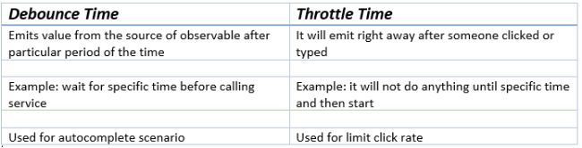

### **1. What is AOT compilation? What are the advantages of AOT?**
Every Angular application consists of components and templates which the browser cannot understand. Therefore, all the Angular applications need to be compiled first before running inside the browser.

Angular provides two types of compilation:

·  JIT(Just-in-Time) compilation

·  AOT(Ahead-of-Time) compilation

In JIT compilation, the application compiles inside the browser during runtime.
Whereas in the AOT compilation, the application compiles during the build time.

The advantages of using AOT compilation are:

·  Since the application compiles before running inside the browser, the browser loads the executable code and renders the application immediately, which leads to **faster rendering**.

·  In AOT compilation, the compiler sends the external HTML and CSS files along with the application, eliminating separate AJAX requests for those source files, which leads to **fewer ajax requests**.

·  Developers can detect and handle errors during the building phase, which helps in **minimizing errors**.

·  The AOT compiler adds HTML and templates into the JS files before they run inside the browser. Due to this, there are no extra HTML files to be read, which provide **better security** to the application.

By default, angular builds and serves the application using JIT compiler:

ng build
ng serve

For using AOT compiler following changes should be made:

ng build --aot
ng serve --aot
### **6. Explain Components, Modules and Services in Angular**
For better understanding, I would like you to create an Angular application by running the following inside the command terminal:

ng new angularApp

The above command will create an angular application in the directory.
Next, let's move on to understand Components, Modules, and Services.

**Components**
In Angular, components are the basic building blocks, which control a part of the UI for any application.
A component is defined using the **@Component** decorator. Every component consists of three parts, the template which loads the view for the component, a stylesheet which defines the look and feel for the component, and a class that contains the business logic for the component.
For creating a component, inside the command terminal, navigate to the directory of the application created, and run the following command:

ng generate component test

Or

ng g c test

One can see the generated component inside src/app/test folder. The component will be defined inside test.component.ts and this is how it looks:

`      `import { Component, OnInit } from '@angular/core';

`      `@Component({

`        `selector: 'app-test',

`        `templateUrl: './test.component.html',

`        `styleUrls: ['./test.component.css']

`      `})

`      `export lass TestComponent implements OnInit {

`        `constructor() {}

`        `ngOnInit() {

`        `}

`      `}

As we can see in the above image, our component is defined with **@Component** decorator.

**Modules**
A module is a place where we can group components, directives, services, and pipes. Module decides whether the components, directives, etc can be used by other modules, by exporting or hiding these elements. Every module is defined with a @NgModule decorator.
By default, modules are of two types:

·  Root Module

·  Feature ModuleEvery application can have only one root module whereas, it can have one or more feature modules.
A root module imports **BrowserModule**, whereas a feature module imports **CommonModule**.

In the application that we created before, one can see that the root module is defined inside **app.module.ts** and this is how it looks:

`      `import { BrowserModule } from '@angular/platform-browser';

`      `import { NgModule } from '@angular/core';

`      `import { AppComponent } from './app.component';

`      `import { TestComponent } from './test/text.component';

`      `@NgModule({

`        `declarations: [

`          `AppComponent,

`          `TestComponent

`        `],

`        `imports: [

`          `BrowserModule

`        `],

`        `providers: [],

`        `bootstrap: [AppComponent]

`      `})

`      `export class AppModule { }

We can see in the above image that the component we created earlier is already imported in the declarations array.

To create a feature module, run the following command:

ng g m test-module

The module is created inside the src/app/test-module/test-module.module.ts file:

`      `import { NgModule } from '@angular/core';

`      `import { CommonModule } from '@angular/common';

`      `@NgModule({

`        `declarations: [],

`        `imports: [

`          `CommonModule

`        `]

`      `})

`      `export class TestModuleModule { }

As one can see, **CommonModule** is imported since this is a feature module.

**Services** Services are objects which get instantiated only once during the lifetime of an application. The main objective of a service is to share data, functions with different components of an Angular application.
A service is defined using a **@Injectable** decorator. A function defined inside a service can be invoked from any component or directive.

To create a service, run the following command:

ng g s test-service

The service will be created inside src/app/test-service.service.ts:

`      `import { Injectable } from '@angular/core';

`      `@Injectable({

`        `providedIn: 'root'

`      `})

`      `export class TestServiceService {

`        `constructor() { }

`      `}

Any method/function defined inside the TestServiceService class can be directly used inside any component by just importing the service.
### **2. What are lifecycle hooks in Angular? Explain a few lifecycle hooks.**
Every component in Angular has a lifecycle, different phases it goes through from the time of creation to the time it's destroyed. Angular provides **hooks** to tap into these phases and trigger changes at specific phases in a lifecycle.

**ngOnChanges( )** This hook/method is called before **ngOnInit** and whenever one or more input properties of the component changes.
This method/hook receives a SimpleChanges object which contains the previous and current values of the property.

**ngOnInit( )** This hook gets called once, after the **ngOnChanges** hook.
It initializes the component and sets the input properties of the component.

**ngDoCheck( )** It gets called after **ngOnChanges** and **ngOnInit** and is used to detect and act on changes that cannot be detected by Angular.
We can implement our change detection algorithm in this hook. **ngAfterContentInit( )** It gets called after the first **ngDoCheck** hook. This hook responds after the content gets projected inside the component.

**ngAfterContentChecked( )** It gets called after **ngAfterContentInit** and every subsequent **ngDoCheck**. It responds after the projected content is checked.

**ngAfterViewInit( )** It responds after a component's view, or a child component's view is initialized.

**ngAfterViewChecked( )** It gets called after **ngAfterViewInit**, and it responds after the component's view, or the child component's view is checked.

**ngOnDestroy( )** It gets called just before Angular destroys the component. This hook can be used to clean up the code and detach event handlers.

Let’s understand how to use **ngOnInit** hook, since it’s the most oftenly used hook. If one has to process lot of data during component creation, it’s better to do it inside **ngOnInit** hook rather than the constructor:

`      `import { Component, OnInit } from '@angular/core';

`      `@Component({

`        `selector: 'app-test',

`        `templateUrl: './test.component.html',

`        `styleUrls: ['./test.component.css']

`      `})

`      `export class TestComponent implements OnInit {

`        `constructor() { }

`        `ngOnInit() {

`          `this.processData();

`        `}

`        `processData(){

`          `// Do something..

`        `}

`      `}

As you can see we have imported OnInit but we have used **ngOnInit** function. This principle should be used with the rest of the hooks as well.
### **3. Explain string interpolation and property binding in Angular.**
String interpolation and property binding are parts of **data-binding** in Angular.
Data-binding is a feature in angular, which provides a way to communicate between the component(Model) and its view(HTML template).
Data-binding can be done in two ways, **one-way** binding and **two-way** binding.
In Angular, data from the component can be inserted inside the HTML template. In one-way binding, any changes in the component will directly reflect inside the HTML template but, vice-versa is not possible. Whereas, it is possible in two-way binding.

String interpolation and property binding allow only one-way data binding.
String interpolation uses the double curly braces **{{ }}** to display data from the component. Angular automatically runs the expression written inside the curly braces, for example, {{ 2 + 2 }} will be evaluated by Angular and the output 4, will be displayed inside the HTML template. Using property binding, we can bind the DOM properties of an HTML element to a component's property. Property binding uses the square brackets **[ ]** syntax.
### **5. How are Angular expressions different from JavaScript expressions?**
The first and perhaps, the biggest difference is that Angular expressions allow us to write JavaScript in HTML which is not the case when it comes to JavaScript expressions.
Next, Angular expressions are evaluated against a **local** scope object whereas JavaScript expressions against **global** window object. Let's understand that better with an example :

Consider the following component named test:

`      `import { Component, OnInit } from '@angular/core';

`      `@Component({

`        `selector: 'app-test',

`        `template: `

`            `<h4>{{message}}</h4>

`        ``,

`        `styleUrls: ['./test.component.css']

`      `})

`      `export class TestComponent implements OnInit {

`        `message:string = “Hello world”;

`        `constructor() { }

`        `ngOnInit() {

`        `}

`      `}

As one can see that Angular expression is used to display **message** property of a component. Since we are using Angular expressions, in the present template, we cannot access a property outside of its local scope, which in this case is **TestComponent**.
This proves that Angular expressions are always evaluated based on **scope** object rather than the global object.

Next difference is how Angular expressions handle **null** and **undefined**.
Consider the following JavaScript example:

`      `<!DOCTYPE html>

`      `<html lang="en">

`      `<head>

`          `<meta charset="UTF-8">

`          `<meta name="viewport" content="width=device-width, initial-scale=1.0">

`          `<title>JavaScript Test</title>

`      `</head>

`      `<body>

`          `

`      `</body>

`      `

`      `</html>

If you run the above code, you will see **undefined** displayed on the screen. Although it’s not ideal to leave any property undefined, the user does not need to see this.
Now consider the following Angular example:

`      `import { Component, OnInit } from '@angular/core';

`      `@Component({

`        `selector: 'app-new',

`        `template: `

`            `<h4>{{message}}</h4>

`        ``,

`        `styleUrls: ['./new.component.css']

`      `})

`      `export class NewComponent implements OnInit {

`        `message:object = {};

`        `constructor() { }

`        `ngOnInit() {

`        `}

`      `}

If you render the above component, you will **not** see undefined being displayed on the screen.

Next, in Angular expressions one **cannot** use loops, conditionals and exceptions.

The difference which makes Angular expressions quite beneficial is the use of **pipes**. Angular uses pipes(called filters in AngularJS), which can be used to format data before displaying it. Let’s see one predefined pipe in action:

`      `import { Component, OnInit } from '@angular/core';

`      `@Component({

`        `selector: 'app-new',

`        `template: `

`            `<h4>{{message | lowercase}}</h4>

`        ``,

`        `styleUrls: ['./new.component.css']

`      `})

`      `export class NewComponent implements OnInit {

`        `message:string = "HELLO WORLD";

`        `constructor() { }

`        `ngOnInit() {

`        `}

`      `}

In the above code we have used a predefined pipe called **lowercase**, which transforms all the letters in lowercase. Therefore, if you render the above component, you will see “hello world” being displayed.

In contrast, JavaScript does not have the concept of **pipes**.
### **6. How are observables different from promises?**
The first difference is that an Observable is **lazy** whereas a Promise is **eager**.

|Promise|Observable|
| :- | :- |
|Emits a single value|Emits multiple values over a period of time|
|Not Lazy|Lazy. An observable is not called until we subscribe to the observable|
|Cannot be cancelled|Can be cancelled by using the unsubscribe() method|
| |Observable provides operators like map, forEach, filter, reduce, retry, retryWhen etc.|

Consider the following Observable:

`      `const observable = rxjs.Observable.create(observer => {

`        `console.log('Text inside an observable');

`        `observer.next('Hello world!');

`        `observer.complete();

`      `});

`      `console.log('Before subscribing an Observable');

`      `observable.subscribe((message)=> console.log(message));

When you run the above Observable, you can see messages being displayed in the following order:

Before subscribing an Observable
Text inside an observable
Hello world!

As you can see, observables are lazy. Observable runs only when someone subscribes to them hence, the message “Before subscribing…” is displayed ahead of the message inside the observable.

Now let’s consider a Promise:

`      `const promise = new Promise((resolve, reject) => {

`        `console.log('Text inside promise');

`        `resolve('Hello world!');

`      `});

`      `console.log('Before calling then method on Promise');

`      `greetingPoster.then(message => console.log(message));

Running the above promise, the messages will be displayed in the following order:

Text inside promise
Before calling then method on Promise
Hello world!

As you can see the message inside Promise is displayed first. This means that a promise runs before the **then** method is called. Therefore, promises are **eager**.

The next difference is that Promises are always **asynchronous**. Even when the promise is immediately resolved. Whereas an Observable, can be both **synchronous** and **asynchronous**.

The above example of an observable is the case to show that an observable is synchronous. Let’s see the case where an observable can be asynchronous:

`      `const observable = rxjs.Observable.create(observer => {

`        `setTimeout(()=>{

`            `observer.next('Hello world');

`            `observer.complete();

`        `},3000)

`      `});

`      `console.log('Before calling subscribe on an Observable');

`      `observable.subscribe((data)=> console.log(data));

`      `console.log('After calling subscribe on an Observable');

The messages will be displayed in the following order:

Before calling subscribe on an Observable
After calling subscribe on an Observable
Hello world!

You can see in this case, observable runs asynchronously.

The next difference is that Observables can emit **multiple** values whereas Promises can emit only one value.

The biggest feature of using observables is the use of **operators**. We can use multiple operators on an observable whereas, there is no such feature in a promise.
### **7. Angular by default, uses client-side rendering for its applications.**
Can one make an angular application to render on the server-side?
Yes, angular provides a technology called **Angular Universal**, which can be used to render applications on the server-side.

The advantages of using Angular Universal are :

·  First time users can instantly see a view of the application. This benefits in providing **better user experience**.

·  Many search engines expect pages in plain HTML, thus, Universal can make sure that your content is available on every search engine, which leads to **better SEO**.

·  Any server-side rendered application **loads faster** since rendered pages are available to the browser sooner.
### **8. What are directives in Angular?**
A directive is a class in Angular that is declared with a **@Directive** decorator.
Every directive has its own behaviour and can be imported into various components of an application.

**When to use a directive?**
Consider an application, where multiple components need to have similar functionalities. The norm thing to do is by adding this functionality individually to every component but, this task is tedious to perform. In such a situation, one can create a **directive** having the required functionality and then, import the directive to components which require this functionality.

**Types of directives**
**Component directives**
These form the main class in directives. **Instead** of @Directive decorator we use **@Component** decorator to declare these directives. These directives have a view, a stylesheet and a selector property.

**Structural directives**
These directives are generally used to manipulate DOM elements.
Every structural directive has a ‘ \* ’ sign before them.
We can apply these directives to any DOM element.

Let’s see some built-in structural directives in action:

`      `

`          `{{name}}

`      `

`      `

`          `
{{x.name}}

`          `
 {{x.address}}

`          `
{{x.age}}

`      `

In the above example, we can \*ngIf and \*ngFor directives being used.

\*ngIf is used to check a boolean value and if it’s truthy,the div element will be displayed.

\*ngFor is used to iterate over a list and display each item of the list.

**Attribute Directives**

These directives are used to change the look and behaviour of a DOM element. Let’s understand attribute directives by creating one:

How to create a custom directive?

We’re going to create an attribute directive:

In the command terminal, navigate to the directory of the angular app and type the following command to generate a directive:

ng g directive blueBackground

The following directive will be generated. Manipulate the directive to look like this:

`      `import { Directive, ElementRef } from '@angular/core';

`      `@Directive({

`       `selector: '[appBlueBackground]'

`      `})

`      `export class BlueBackgroundDirective {

`       `constructor(el:ElementRef) {

`         `el.nativeElement.style.backgroundColor = "blue";

`       `}

`      `}

Now we can apply the above directive to any DOM element:

`      `
Hello World!

### **9. How does one share data between components in Angular?**
Following are the commonly used methods by which one can pass data between components in angular:

**Parent to child using @Input decorator**

Consider the following parent component:

`      `@Component({

`        `selector: 'app-parent',

`        `template: `

`          `<app-child [data]=data></app-child>

`        `` ,

`        `styleUrls: ['./parent.component.css']

`      `})

`      `export class ParentComponent{

`        `data:string = "Message from parent";

`        `constructor() { }

`      `}

In the above parent component, we are passing “data” property to the following child component:

`      `import { Component, Input} from '@angular/core';

`      `@Component({

`        `selector: 'app-child',

`        `template:`

`          `
{{data}}

`        ``,

`        `styleUrls: ['./child.component.css']

`      `})

`      `export class ChildComponent {

`        `@Input() data:string

`        `constructor() { }

`      `}

In the child component, we are using @Input decorator to capture data coming from a parent component and using it inside the child component’s template.

**Child to parent using @ViewChild decorator**

Child component:

`      `import {Component} from '@angular/core';

`      `@Component({

`        `selector: 'app-child',

`        `template:`

`          `
{{data}}

`        ``,

`        `styleUrls: ['./child.component.css']

`      `})

`      `export class ChildComponent {

`        `data:string = "Message from child to parent";

`        `constructor() { }

`      `}

Parent Component

`      `import { Component,ViewChild, AfterViewInit} from '@angular/core';

`      `import { ChildComponent } from './../child/child.component';

`      `@Component({

`        `selector: 'app-parent',

`        `template: `

`          `
{{dataFromChild}}

`        `` ,

`        `styleUrls: ['./parent.component.css']

`      `})

`      `export class ParentComponent implements AfterViewInit {

`        `dataFromChild: string;

`        `@ViewChild(ChildComponent,{static:false}) child;

`        `ngAfterViewInit(){

`          `this.dataFromChild = this.child.data;

`        `}

`        `constructor() { }

`      `}

In the above example, a property named “data” is passed from the child component to the parent component.
**@ViewChild** decorator is used to reference the child component as “child” property.
Using the **ngAfterViewInit** hook, we assign the child’s data property to the messageFromChild property and use it in the parent component’s template.

**Child to parent using @Output and EventEmitter**

In this method, we bind a DOM element inside the child component, to an event ( **click** event for example ) and using this event we emit data that will captured by the parent component:

Child Component:

`      `import {Component, Output, EventEmitter} from '@angular/core';

`      `@Component({

`        `selector: 'app-child',

`        `template:`

`          `<button (click)="emitData()">Click to emit data</button>

`        ``,

`        `styleUrls: ['./child.component.css']

`      `})

`      `export class ChildComponent {

`        `data:string = "Message from child to parent";

`        `@Output() dataEvent = new EventEmitter<string>();

`        `constructor() { }

`        `emitData(){

`          `this.dataEvent.emit(this.data);

`        `}

`      `}

As you can see in the child component, we have used **@Output** property to bind an **EventEmitter**. This event emitter emits data when the button in the template is clicked.

In the parent component’s template we can capture the emitted data like this:

`      `<app-child (dataEvent)="receiveData($event)"></app-child>

Then inside the receiveData function we can handle the emitted data:

` `receiveData($event){

`        `this.dataFromChild = $event;

`      `}

### **10. Explain the concept of Dependency Injection?**
Dependency injection is an application design pattern which is implemented by Angular.
It also forms one of the core concepts of Angular.

**So what is dependency injection in simple terms?**
Let’s break it down, dependencies in angular are nothing but services which have a functionality. Functionality of a service, can be needed by various components and directives in an application. Angular provides a smooth mechanism by which we can inject these dependencies in our components and directives.
So basically, we are just making dependencies which are injectable across all components of an application.

Let’s understand how DI (Dependency Injection) works:

Consider the following service, which can be generated using:

ng g service test

`      `import { Injectable } from '@angular/core';

`      `@Injectable({

`        `providedIn: 'root'

`      `})

`      `export class TestService {

`        `importantValue:number = 42;

`        `constructor() { }

`        `returnImportantValue(){

`          `return this.importantValue;

`        `}

`      `}

As one can notice, we can create injectable dependencies by adding the **@Injectable** decorator to a class.

We inject the above dependency inside the following component:

`      `import { TestService } from './../test.service';

`      `import { Component, OnInit } from '@angular/core';

`      `@Component({

`        `selector: 'app-test',

`        `templateUrl: './test.component.html',

`        `styleUrls: ['./test.component.css']

`      `})

`      `export class TestComponent implements OnInit {

`        `value:number;

`        `constructor(private testService:TestService) { }

`        `ngOnInit() {

`          `this.value = this.testService.returnImportantValue();

`        `}

`      `}

One can see we have imported our TestService at the top of the page. Then, we have created an instance inside the constructor of the component and implemented the **returnImportantValue** function of the service.

From the above example, we can observe how angular provides a smooth way to inject dependencies in any component.
### **11. Explain MVVM architecture**
MVVM architecture consists of three parts:

1\. Model
2\. View
3\. ViewModel

Model contains the structure of an entity. In simple terms it contains data of an object.
View is the visual layer of the application. It displays the data contained inside the Model. In angular terms, this will be the HTML template of a component.

ViewModel is an abstract layer of the application. A viewmodel handles the logic of the application. It manages the data of a model and displays it in the view.
View and ViewModel are connected with data-binding (two-way data-binding in this case). Any change in the view, the viewmodel takes a note and changes the appropriate data inside the model.

**12. What is the difference between constructor and ngOnInit?**

One of the common questions which pop up in the interviewer’s mind is what is the difference between constructor and ngOnInit? We mostly go with the answer that we write the dependencies in the constructors while we write logics in the ngOninit.

Sometimes, the interviewer will check what else we know about it? Why can’t we put the services or logics in constructors?

The simple answer is that sometimes, we need to wait until all dependencies get loaded; or for parent/child components, we might need to wait until the component is loaded. That’s why it’s preferable to write the logic in ngOnInit.

Let’s check other differences.

**13. What is the difference between components and directives?**

This one is extremely common too. The easy answer is directives do not have their shadow DOM while components have their HTML. Components used to break our application based on features, while directives only help to change the behavior of certain elements.

Let’s check out some other differences.

**14. What is the difference between ElementRef, TemplateRef, and viewContainerRef?**

This question comes for more advanced Angular interviews where the interviewer wants to check how you are manipulating views or do you have experience in creating dynamic views in your Angular application.

Let’s check out the difference between ElementRef, TemplateRef, and viewContainterRef with examples.

*ElementRef Example:*

*TemplateRef Example:*

*ViewContainerRef Example:*

**15. What is the difference between ng-content,ng-template, and ng-container?**

Doesn’t it look the same? Yes, when I was learning Angular all 3 keywords were the same for me but actually, all carry their own purposes.

Let’s check out the difference between ng-content,ng-template, and ng-container with examples.

*ng-content example:*

*ng-template example:*

*ng-container example:*

**16. What is the difference between view-child and content-child?**

We do deal with a lot of parent-child or sub-components. As Angular does support creating dynamic component on the fly or access the relative components based on their relation interviewer expect that we know the difference between view-child and content-child.

Let’s check the difference between view-child and content-child with the examples.

*View-Child Example:*

*Content-Child Example:*

**17. What is the difference between component view, host view, and embedded view?**

This is an advanced Angular interview question that can be asked to know how the different views work in Angular.

Let’s check the difference between component view, host-view, and embedded views with the examples.

*Embedded View Example:*

*Host View Example:*

**17. What is the difference between debounce time and throttle time?**

When we deal with the reactive forms and want the user to type and check on service based on the inputs this two-term is very handy.

**18. What is the difference between forEach and map?**

Let’s discuss the basic JavaScript interview question. Sometimes interviewer asks when we can use forEach and map and what are the differences between them.

Let’s check out the difference between forEach and map.

***Let’s check out some practical code to understand this concept better.***

**19. What is the difference between ng-content and ng-templateoutlet?**

When we deal with multiple templates it is better to write reusable logic in the template itself. Having knowledge of these two terms can boost your chance to crack the Angular developer interviews.

*ng-content Example:*

*ng-templateoutlet example:*

**19. What is the difference between forchild vs forroot?**

This is a bit advanced topic but the basic difference is by using forchild and forroot we can change the visibility of instances of service in the application.

If you would like to know more about this topic. Kindly check this article.

[**Understand Angular’s forRoot and forChild**](https://medium.com/javascript-in-plain-english/understand-angulars-forroot-and-forchild-f27fbc41cb7b)

[And why we need them for Routing](https://medium.com/javascript-in-plain-english/understand-angulars-forroot-and-forchild-f27fbc41cb7b)

[medium.com](https://medium.com/javascript-in-plain-english/understand-angulars-forroot-and-forchild-f27fbc41cb7b)

**20. Why we use pipe operators in RXJS. What is the use of it?**

pipe method helps to write multiple rxjs functions together and it combines everything.

for example:

of(1,2,3).pipe(
` `map(x => x + 1),
` `filter(x => x > 2)
);

1. The pipe() the function takes as its arguments the functions you want to combine, and returns a new function that, when executed, runs the composed functions in sequence.
1. we can use the .pipe() method to pass in one or multiple operator functions that can work on and transform each item in the observable collection.

**21. What is the difference between using the Async pipe vs the subscribe function in the Angular application?**

We do use Async pipe and subscribe function a lot in our application but what are the basic difference between them and why we do use one then other?

Let’s check it out.

**22. What is the difference between promise and observable?**

We do deal with both of the keywords lots but when should we use promise and observable? If we know the difference between promises and observables it will help us out to understand.

**23. What is the difference between Event Emitter and Subjects?**

We do use EventEmitter when we want to communicate child to parent components while subjects can be used when we want to communicate between un-relational components.

Below are two differences between them.

**15. What is the difference between Observable and Subject?**

This is one of the common questions asked in the Angular interviews. Let’s understand the difference between Observable and Subject.

**16. What is the difference between Activated Route vs Activated route Snapshot?**

The major difference between Activated Route vs Activated Route Snapshot is with Activated Route we can subscribe to Observable while Activated Route Snapshot only emits one value.

**17. Discuss a different kind of loading strategies used in your Angular application**

This kind of question asked to check how deep you have used Angular. Most of the times we answer lazy loading and eager loading but there is one more in the list which we should consider….

**Eager Loading**

Feature modules under Eager Loading would be loaded before the application starts. This is the default module-loading strategy.

**Lazy Loading**

Feature modules under Lazy Loading would be loaded on-demand after the application starts. It helps to start the application faster.

**Pre-Loading**

Feature Modules under Pre-Loading would be loaded automatically after the application starts.

To know about how to use please follow the below link

[**Eager Loading, Lazy Loading, and Pre-Loading in Angular 2+: What, When, and How?**](https://medium.com/@lifei.8886196/eager-loading-lazy-loading-and-pre-loading-in-angular-2-what-when-and-how-798bd107090c)

[Angular 2+ has been a very popular front-end platform for modern web applications since 2016. It introduced a…](https://medium.com/@lifei.8886196/eager-loading-lazy-loading-and-pre-loading-in-angular-2-what-when-and-how-798bd107090c)

[medium.com](https://medium.com/@lifei.8886196/eager-loading-lazy-loading-and-pre-loading-in-angular-2-what-when-and-how-798bd107090c)

**18. What is Metadata?**

Have heard about this word? We do use this daily meta in form of the class decorator or property decorator or other ways.

Let’s the definition of Metadata.

*Metadata is used to decorate a class so that it can be configured the expected behavior of a class.*

Below are the examples of metadata used in Angular.

1. ***Class Decorator*** — @component
1. ***Property Decorator*** — @Input
1. ***Method Decorator*** — @HostListner
1. ***Parameter Decorator*** — @Inject

**19. What is routerlinkActive use for?**

This is the most commonly used directive when we do use navbar in our application. When we want to write CSS based on the active tab routerlinkActive is checked with boolean conditions.

The **RouterLinkActive** is a directive for adding or removing classes from an HTML element that is bound to a RouterLink. **Using** this directive, we can toggle CSS classes for active Router Links based on the current RouterState. The main **use** case of this directive is to highlight which route is currently active.

**20. Where we use generics in Angular?**

This is one of the latest interview questions in Angular. Interviewers want to check how good you are writing clean by typecasting objects or specific Observable or Events.

There are different places where we commonly use generics.

1. ***While defining emitters***

Output() click : EventEmitter<string> = new EventEmitter<string>()

2\. ***While capturing the response from observable***

data: Observable<IResponse>

3\. ***Defining Interfaces***

interface Item {
info:string,
…
}
Input public items: Item[]

**21. What is the wild card route?**

One of the common use wild card route redirects to this route if someone types something which is not the proper path.

If the requested route URL does not belong to what’s mentioned in the code, we get an error in the console.

So to avoid this error, and instead tell the user that the route doesn’t exist, we use **WILDCARD ROUTES.**

Example:

**22. What is the difference between ngIf and hidden?**

Isn’t it both same? both have the same function of hiding the things.No, but if you check that ngIf won’t load template if conditions get false while hidden will load the template and hide it.

**ngIf** will comment on the data if the expression is false. This way the data are not even loaded, causing HTML to load faster.

**[hidden]** will load the data and mark them with the *hidden* HTML attribute. This way data are loaded even if they are not visible.

So *[hidden]* is better used when we want the show/hide status to change frequently, for example on a button click event, so we do not have to load the data every time the button is clicked, just changing its *hidden* attribute would be enough.

**23. What is a router outlet?**

We do see this tag in the main app component HTML. But what is it? Let’s understand this term.

The router-outlet is a directive that’s available from the @angular/router package and is used by the router to mark wherein a template, a matched component should be inserted.

Thanks to the router outlet, your app will have multiple views/pages and the app template acts as a shell of your application. Any element, you add to the shell will be rendered in each view, only the part marked by the router outlet will be changed between views.

**24. What is the Router state?**

As the term defined router state maintains the state of the routes and can be accessed by subscribing to specific route events.

*Let’s understand in a detailed manner.*

RouterState and ActivatedRoute are similar to their snapshot counterparts except that they expose all the values as observables, which are great for dealing with values changing over time.

**Any component instantiated by the router can inject its ActivatedRoute.**

If we navigate from “/inbox/33/messages/44” to “/inbox/33/messages/45”, the data observable will emit a new set of data with the new message object, and the component will display Message 45.

**Accessing Snapshots**

The router exposes parameters and data as observables, which is convenient most of the time, but not always. Sometimes what we want is a snapshot of the state that we can examine at once.

**25. What is an Active route?**

**ActivatedRoute provides access to the URL, params, data, queryParams, and fragment observables.**

**URL changes are the source of any changes in a route.** And it has to be this way as the user has the ability to modify the location directly.

**Any time the URL changes, the router derives a new set of parameters from it**: the router takes the positional parameters (e.g., ‘: id’) of the matched URL segments and the matrix parameters of the last matched URL segment and combines those. This operation is pure: the URL has to change for the parameters to change. Or in other words, the same URL will always result in the same set of parameters.

**Next, the router invokes the route’s data resolvers and combines the result with the provided static data.**

Given the following:

And navigating first to “/inbox/33/data/44” and then to “/inbox/33/data/45”, we will see:

url [{path: ‘data’, params: {}}, {path: ‘44’, params: {}}]
url [{path: ‘data’, params: {}}, {path: ‘45’, params: {}}]

**26. Explain different injections in Angular.**

One of the common interview questions asked in Angular interview questions is how you are using injections in Angular application?

There are 5 different ways we Angular provide dependency injections

1. **use class**
1. **use value**
1. **use factory**
1. **token factory**
1. **component injections**

**27. What is the best way to implement translations in Angular?**

In the Single Page Application, One of the main features is multi-language support on the fly. But Sometimes the interviewer asks have you implemented translations in your application?

The most common library used for this is ngx-translate which provides a translation by adding in the JSON.

***Let’s check out some practical code to understand this concept better.***

**28. Explain different routing params in Angular.**

We do use routing parameters to maintain the data or sometimes pass data when navigating from one route to another route.

Angular does support the following routing parameters.

1. Required Parameters
1. Optional Parameters
1. Query Parameters
1. NavigationExtras

**29. What is a virtual scroll in Angular?**

Here Interviewer wants to check if you have updated knowledge of the latest Angular features.

The central concept behind virtual rendering is rendering only visible items.

For example, if there are thousands of alerts in an application, an efficient way would be to load only the elements that are visible and unload them when they are not by replacing them with new ones.

An initial implementation of virtual scrolling is now available in @angular/cdk. (v7.0.0-beta.0)

**30. What is the difference between route param vs query param?**

The key difference between query parameters and [route parameters](https://javascript.plainenglish.io/routing/routeparams) is that the route parameter is essential to determining the route, whereas query parameters are optional.

Let’s understand some of the basics of Routing in Angular.

**Declaring Route Parameters**

The route for the component that displays the details for a specific product would need a route parameter for the ID of that product. We could implement this using the following Routes:

export const routes: Routes = [{ path: '', redirectTo: 'data', pathMatch: 'full' },{ path: 'data', component: DataList },{ path: 'data/:id', component: DataDetails }];

Note :id in the path of the product-details the route, which places the parameter in the path. For example, to see the product details page for a product with ID 5, you must use the following URL: localhost:3000/product-details/5

**Passing Query Parameters**

Use the [queryParams] directive along with [routerLink] to pass query parameters. For example:

<a [routerLink]="['data-list']" [queryParams]="{ page: 99 }">Go to Page 99</a>

Alternatively, we can navigate programmatically using the Router service:

goToPage(pageNum) {this.router.navigate(['/data-list'], { queryParams: { page: pageNum } });}

**31. Explain different guards supported in Angular.**

This is one of the most common questions asked in the Angular application.

There are five main guards in Angular. which guards the access of routes.

- CanActivate : will be called before going to the route: *can be used to prevent routing to a specific path*
- CanActivateChild : will be called before going to the child component: *can be used to prevent the loading of child path*
- CanDeactivate : will be called before destroying the component: *can be used to handle the browser events*
- CanLoad : will be called before loading the module: *can be used to prevent the loading of the module*
- Resolve : will be called before loading component: *can be used to prefetch data before loading component*

**32. What is the best way too lazy load the component?**

Lazy loading the modules is one of the best practices when we want to reduce the bundle sizes and avoid loading all modules together.

But What about the lazy loading component? It means we load modules but don’t load components until we need them. It basically creates dynamic components as required and destroying right after use.

**33. What is the way we can display the app version in Angular?**

When we deal with a lot of deployment it is best to display the app version which helps to communicate among the team with the changes.

It can be achieved by following these steps.

1. In your /tsconfig.json (sometimes also necessary in /src/tsconfig.app.json) enable the resolveJsonModule option (webpack dev server restart required afterward):

"compilerOptions": {
...
`      `"resolveJsonModule": true
...

1. Then in your component, for example /src/app/app.component.ts use the version info:

import { version } from '../../package.json';
...
`    `export class AppComponent {
`      `public version: string = version;
`    `}

It’s also possible to do step 2 in your environment.ts file, making the version info accessible from there.

**34. What are the generators in ES6?**

Generator functions can pause and be resumed one or multiple times, which makes them interesting and very different from normal functions. While the function is paused, it allows other functions and code to execute. By default, generators are asynchronous.

**35. Explain the Error mechanism in your application.**

All the application have their global error mechanism to handle the errors and log them on Splunk or new relic. Most of the team follow the global error mechanism which logs if any issues come for tracking purposes and redirect the users to specific routes.

**36. What is bootstrapping in Angular?**

Most of the time when this word comes to mind we think like a bootstrap library but no Bootstrapping is a technique of initializing or loading our Angular application.

Sometimes interviewers ask How Angular application loads or explain Angular application loading from the beginning. Let’s check the answer then.

**The Angular takes the following steps to load our first view.**

1. Main.ts the application entry point
1. Index.html loads
1. Angular, Third-party libraries & Application loads
1. App Module
1. App Component
1. app-root will add the component HTML inside

To know in detail see below.

<https://www.tektutorialshub.com/angular/angular-bootstrapping-application/#:~:text=Bootstrapping%20is%20a%20technique%20of,to%20load%20our%20first%20view>.

**37. What are Angular elements? why we use it?**

As Angular grows it comes with really good features. If you heard about microservices architecture to make applications more robust Angular is doing exactly the same.

With Angular Elements, we can plug and play Angular applications to the other frontend frameworks.

With the release of Angular 6, the new Angular Elements functionality is now fully available. By using Angular Elements you can package Angular components as custom elements, a web standard for defining new HTML elements in a framework-agnostic way.

Let’s Continue with more questions.

**38. What is the difference between the arrow function and regular functions?**

I have seen the interviewer started asking basic JavaScript questions to test the knowledge of candidates.

**Candidate:** I do know arrow functions have simpler syntax while regular functions have complex syntax.

The interviewer mostly understand how much deep water is :)

**Answer:**

***1. Argument Binding*** :

Arrow functions do not support an arguments binding while regular functions do have the support of argument binding ( However we can add arguments in arrow functions using spread operator)

***2. This keyword:***

Arrow functions do not support this keyword while regular function has its own keyword support. This feature makes regular functions usage towards the factory method for object creation.

***3. New keyword:***

Regular functions created using function declarations are construable and can be called using the new keyword. However, the arrow functions are only callable and not construable, i.e arrow functions can never be used as constructor functions.

***4. Duplicate Parameters:***

Regular functions allowed duplicate parameters while Arrow functions don’t allow duplicate parameters.

**39. What is the difference between Functional vs Object Oriented Programming language? Which one you prefer and why?**

I have seen a couple of interviewers started asking this kind of question to access candidate knowledge about the programming language they are currently working on.

geeksforgeeks

The Advantages and Features of Functional programmings are:

- **Pure functions**
- **Function composition**
- **Avoid shared state**
- **Avoid mutating state**
- **Provide Higher-Order Functions**

**40. What is the difference between JavaScript and TypeScript?**

Candidate: TypeScript is a superset of JavaScript.

I have seen most of the candidate’s answers plain as they don’t know many advantages of why Angular uses the TypeScript.

- TypeScript is known as an Object-oriented programming language whereas JavaScript is a scripting language.
- TypeScript has a feature of Static typing while JavaScript does not have this feature.
- TypeScript gives support for modules whereas JavaScript does not support modules.
- TypeScript supports Interface but JavaScript does not support Interface.
- TypeScript support optional parameter in the methods but JavaScript does not support optional parameter in methods.

**Advantages of using TypeScript over JavaScript**

- TypeScript always give compilation errors at run time due to this it is easier to fix the issue before deployments
- TypeScript supports static typing which allows for checking type correctness at compile time.

**41. What do you know about Closures?**

A closure is a combination of a function bundled together (enclosed) with references to its surrounding state (the lexical environment). In other words, a closure gives you access to an outer function’s scope from an inner function. In JavaScript, closures are created every time a function is created, at function creation time.

Practically if we want to make any variable private which should not be accessible by any functions we can use closures.

Below is the Simple example I found from stack overflow.

Suppose, you want to **count the number of times a user clicked a button** on a website.
For this, we are triggering a function on **onClick** event of the button to update the count of the variable

<button onclick="updateClickCount()">click</button>

**Now there could be many approaches like:**

\1) You could use a **global variable**, and a function to increase the **counter**:

var counter = 0;

function updateClickCount() {
`    `++counter;
`    `// do something with counter
}

But, the pitfall is that **any script on the page can change the counter, without calling updateClickCount()**.

\2) Now, You might be thinking of declaring the variable inside the function:

function updateClickCount() {
`    `var counter = 0;
`    `++counter;
`    `// do something with counter
}

But, Hey! Every time updateClickCount() function is called, the **counter is set to 1 again.**

\3) Thinking about **Nested functions**?

Nested functions have access to the scope “above” them.
In this example, the inner function updateClickCount() has access to the counter variable in the parent function countWrapper()

function countWrapper() {
`    `var counter = 0;
`    `function updateClickCount() {
`    `++counter;
`    `// do something with counter
`    `}
`    `updateClickCount();    
`    `return counter; 
}

This could have solved the counter dilemma if you could reach the updateClickCount() function from the outside and you also need to find a way to execute counter = 0 only once not every time.

\4) **Closure to the rescue! (self-invoking function)**:

var updateClickCount=(function(){
`    `var counter=0;return function(){
`     `++counter;
`     `// do something with counter
`    `}
})();

The self-invoking function only runs once. It sets the counter to zero (0), and returns a function expression.

This way updateClickCount becomes a function. The "wonderful" part is that it can access the counter in the parent scope.

This is called a **JavaScript closure**. It makes it possible for a function to have “*private*” variables.

The counter is protected by the scope of the anonymous function, and can only be changed using the add function!

***Lets move towards the Angular Questions:***

**42. What is the difference between Template Driven forms and Reactive Forms?**

**43. What are different Kinds of Bindings possible in Angular?**

**One-Way Data Binding**

1. **Interpolation Binding:** It is **a** binding variable in HTML elements by adding curly brackets like

*{{value}}*.

**2. Property Binding:** It is a binding specific property that is declared in the component.

<button [disabled]= “isDisabled” >

**3. Attribute Binding:** Attribute binding is used to bind an attribute property of a view element.

<td [attr.colspan]= “val”></td>

**4. Class Binding:** With the use of this binding method, we can add CSS classes conditionally to an element, creating dynamically styled elements.

<td class= “td” [class.red]= “val.age < 40">{{val.name}}</td>

**5. Style Binding:** it is the same as class binding providing specific style bindings.

<h1 [style.color]=”red”>Red</h1>

**Two-Way Data Binding**

This binding provides bidirectional communication between the component and the HTML.

<input [(ngModel)] ='val'>

**Event Binding**

This binding allows binding to an event.

(click)=”myClickFunction($event)”

Let’s Continue with more questions.

**45. Which RXJS Operators you use mostly to handle HTTP services?**

Below are the Most Commonly used RXJS Operators to handle HTTP Services in Angular.

**SUBSCRIBE**: subscribe is used to get the data from the observable.

const data$ = this.service.getData(id);data$.subscribe((response:IResponse) => console.log(response));

**CATCH ERROR:** Catch Error operator is used to handling errors, returning observable with error messages as below.

const data$ = this.service.getData(id);data$.pipe(catchError(error => of (`error occured: ${error}`))).subscribe((response:IResponse) => console.log(response));

**COMBINE LATEST**

Combine Latest operator is used to emit only the latest values from multiple observable sources.

It is used when we are trying to make multiple API calls. Note: combinelatest will not emit an initial value until each observable emits at least one value.

initializeDetails(id: string): void {
`    `combineLatest([
`            `this.service.getInitData(),
`            `this.service.getDetails(id),
`        `])
.pipe(
`            `catchError((error: HttpErrorResponse) => {
`                `return throwError(error);
`            `}),
`            `finalize(() => ),
`            `takeUntil(this.\_ngUnsubscribe$),
`        `)
.subscribe(() => {});
}

**DEBOUNCE TIME & DISTINCT UNTIL CHANGED**

These operators are a perfect choice in scenarios such as type-ahead where the rate of user input must be controlled.

const inputValue = document.querySelector('input');
const dataObservable$ = fromEvent(inputValue, 'input');
dataObservable$.pipe(
`        `map(event => event.target.value),
`        `debounceTime(2000),
`        `distinctUntilChanged())
.subscribe((data) => console.log(data));

**TAP**

Tap operator is more of a utility operator that can be used to perform transparent actions such as logging.

const dataObservable$ = of (8, 9, 10, 11, 12);
dataObservable$.pipe(
`    `tap(val => console.log(`BEFORE MAP DATA: ${val}`)),
`    `map(val => val + 20),
`    `tap(val => console.log(`AFTER MAP DATA: ${val}`))
).subscribe(data => console.log(data));

you can check the practical example here.

**SWITCH MAP**

One of the major issues with the callbacks or promises that it is really tough for us to cancel the request in middle.

For example, if you watching some video and right after a few seconds you thought of changing to a new video.. at this time we were still waiting for previous video requests and new requests came up. How we can cancel that request? Is this possible?

Yes, SwitchMap makes it possible.

SwitchMap operator provides an easy mechanism to cancel these network requests. For example, look at the below code using the switchMap operator.

const obs$1 = fromEvent(document, 'click');
const obs$2 = interval(1000);
const finalObs$ = obs$1.pipe(
`    `switchMap(event => obs$2)
);
const subscription = finalObs$.subscribe((value) => console.log(value));

**FORK JOIN**

It is used to combine multiple observables and make them in a stream.

It will wait for all observables to complete and then it will emit an array so it is useful to wait for all HTTP services provides a response.

const service1 = http.get < Data1[] > (this.data1);
const service2 = http.get < Data2[] > (this.data2);forkJoin([service1, service2])
.subscribe(res => {
`        `this.data = res;
`        `console.log('Stream Data', res);
`    `});
}

**RETRY**

If the service returns an error this method will resubscribe to the source Observable for a maximum count written in the parameter.

this.authService.getData()
.pipe(
`     `retry(3), // you retry 3 times
`     `delay(1000) // each retry will start after 1 second,
`  `)
.subscribe(res => {
`     `// success
`  `})

retry can be used in the interceptor to retry the HTTP service calls after failure. You can check out the practical example of retry here.

**46. Which RXJS operators used for transforming or manipulating data?**

Below are the most commonly used RXJS operators for transforming data.

**MAP**

the map works the same as the JavaScript map function. It is mostly used to transform the response to the new array.

const data = [{
` `id: 1,
` `value: ‘one’
}, {
` `id: 2,
` `value: ‘two’
}, {
` `id: 3,
` `value: ‘three’
}];const dataObservable$ = from(data).pipe(
` `map(data => data.value)
).subscribe(x => console.log(x));

**REDUCE**

Reduces the values from the source observable to a single value that’s emitted when the source completes.

const data = of(1, 2, 3, 4);

const sum = data.pipe(reduce((acc, val) => acc + val));//output: Sum: 10

const subscribe = sum.subscribe(val => console.log('Sum:', val));

**TOARRAY**

Collects all source emissions and emits them as an array when the source completes.

interval(100).pipe(take(10), toArray()).subscribe(console.log);

**SCAN**

It combines all values emitted on the source and joins them. The only difference between reduce and scan is it emits intermediate accumulations.

const clickEvent = fromEvent(document, 'click');
const observableOne = clickEvent.pipe(mapTo(1));
const seed = 0;
const data = observableOne.pipe(scan((acc, one) => acc + one, seed));
data.subscribe(val => console.log(val));

**46. What is the difference between mergemap/switchmap/concatmap and exhaustmap and where we can use them?**

- **mergeMap** — creates an Observable immediately for any source item, all previous Observables are kept alive

- **concatMap** — waits for the previous Observable to complete before creating the next one

- **switchMap** — for any source item, completes the previous Observable and immediately creates the next one

- **exhaustMap** — source items are ignored while the previous Observable is not completed

To Understand more clearly let’s check the below animation

**if you have observed**

1. **switchmap** will return the outer observable only after the user finish typing so it will cancel all older observables once a new letter starts typing.
1. **concatmap** will be called for each letter I type so outer observable calls each time user will type something so we can see a delay of 1 second for all typing letters
1. **mergemap** will be called immediately still it will keep older observable alive.
1. **exhausmap** will wait for one observable to finish before starting a new one so you can see outer observable might not have the latest value typed in the textbox.

**47. Discuss different decorators in Angular.**

One of the main purposes of a decorator is storing metadata about a class, method, or property. The whole point of a decorator is to store metadata about a class, method, or property as we’ve already explored.

- **Class decorators:** @Component @NgModule @Pipe
- **Property decorators for properties inside classes:** @Input @Output @ContentChild @ContentChildren @ViewChild @ViewChildren
- **Method decorators for methods inside classes:**@HostListener @HostBinding
- **Parameter decorators for parameters inside class constructors:**@Inject

**48. Explain different lifecycle methods in Angular.**

1. **Constructor**: A default method which is called when the class is instantiated.
1. **ngOnChanges**: Executes when a new component is created, when one of the bound properties with @Input changes, also it is the only hook that takes an argument when it is called which is called as SimpleChanges.
1. **ngOnInit**: Called once the component is initialized. This doesn’t allow the component to be visible over the DOM. This runs just after the constructor.
1. **ngDoCheck**: Runs when change detection runs. It also runs if there is no change and even if it is just an event that occurred, just in case to make sure if there is something that has changed. (for eg: It will run after a button click event irrespective of that it is making ant change or not)
1. **ngAfterContentInit**: This is called after content(ng-content) has been projected into the view.
1. **ngAfterContentChecked**: This is called after every projected content has been checked.
1. **ngAfterViewInit**: Called after the components view (and child view) has been initialized.
1. **ngAfterViewChecked**: Called every time the view (and child view) has been checked.

**49. Explain the hierarchy of the Angular Life cycle hooks.**

This Diagram given by [Raed Khalaf](https://stackoverflow.com/users/8019528/raed-khalaf) helped me a lot to check the flow of the angular life cycle hooks.

*Let’s check out some practically how it works.*

**50. What is renderer 2?**

Renderer2 is a simple default wrapper around DOM manipulation browser API. Renderer2 is primarily used by creating a Custom Directive.

constructor(el: ElementRef, renderer: Renderer2) {
`    `renderer.addClass(el.nativeElement, 'some');
}

**51. What is the difference between renderer and ElementRef?**

The Renderer is a class that is a partial abstraction over the DOM. Using the Renderer for manipulating the DOM doesn't break server-side rendering or Web Workers (where direct access to the DOM would break).

ElementRef is a class that can hold a reference to a DOM element. This is again an abstraction to not break in environments where the browsers DOM isn't actually available.

If ElementRef is injected to a component, the injected instance is a reference to the host element of the current component.

Renderer acts on the DOM and ElementRef is a reference to an element in the DOM the Renderer acts on.

**52. What is Zone.js?**

*Zone creates a wrapper around all asynchronous operations in the browser such as user interactions, HTTP, timers, and any other changes that can cause changes in state.*

Zone knows when any these operations completes. Angular in-turn, **subscribes to notifications** from Zone for whenever one of these operations completes. This lets Angular know that it can run its **change detection** algorithms and re-render anything that has changed.This minimizes any rendering churn and makes it efficient.

In some cases, we might want our code to be executed without a zone then we can use the method **runOutsideAngular** of the **NgZone.**

When we run outside zone none of the async events will be picked by Angular which means there is no Change Detection takes in place. This is means the view will not be updated until we re-enter the zone.

This feature can be helpful only when we don’t want to update the view all time and want to update the view after a certain time.

**53. What is Race Condition in Angular?**

Race conditions mostly happen with the autocomplete features where the user is tying one input word ‘test’ and API service call happens to get the data for ‘test and in between sudden user started typing the other characters ‘test’ and API fetches the result first for ‘abc’… now the older service call for ‘test’ finishes and give results of a test which might lead to data overwritten of the ‘abc’.

This type of situation happens when one observable gets delayed somehow and the other observable finishes first.

**Solution:**

To resolve this issue we need to cancel the older observable for ‘test’ once the user started typing ‘abc’. RXJS provides a solution using switchmap to achieve this.

this.form
.get('userInput')
.valueChanges
.pipe(
`        `debounceTime(500),
`        `tap(() => this.isLoading = true),
`        `switchMap(value => this.service.search({
`                `name: value
`            `}, 1)
.pipe(
`                `finalize(() => this.isLoading = false),
`            `)
`        `)
`    `)
.subscribe(response => this.data = response);

**54. What is a callback, Promises and Async/Await in Angular?**

**Callbacks:** A callback is a function that is passed to another function. When the first function is done, it will run the second function.

function(callback){
`  `//do some tasks 
`   `callback();
}

**Promises:** A promise is used to handle the asynchronous result of an operation. JavaScript is designed to not wait for an asynchronous block of code to completely execute before other synchronous parts of the code can run. With Promises, we can defer the execution of a code block until an async request is completed. This way, other operations can keep running without interruption. ([source](https://www.loginradius.com/blog/async/callback-vs-promises-vs-async-await/))

test(function(){
`    `return test1(function(){
`        `return test2(function(){
`            `return test3(function(){
`                `done()
`            `})
`        `})
`    `})
})

It makes it more readable like this:

test()
.then(test1)
.then(test2)
.then(test3)
.then(done)

**Async / Await:** The async function is used to write asynchronous code, specifically promises. inside of this function, the keyword **await** is used to pause the execution of a promise until it is resolved. In other words, it waits for the promise to resolve and then resume the async function.

async function test(){
`    `let data = await getData() // it waits until we get data
`    `return data;
}

**55. What is Host binding and Host Listener in Angular?**

**@HostListener** - will continuously listen to the event emitted by the host element which is declared with @HostListener.

**@HostBinding** - It will bind with the property to the host element, If anything happens to bind, HostBinding will update the host element.

In simple words,

- @HostBinding: This decorator binds a **class property** to a property of the host element.
- @HostListener: This decorator binds a **class method** to an event of the host element.

**56. What is dependency injection in Angular?**

Dependency Injection (DI) is a core concept of Angular and allows a class to receive dependencies from another class. Most of the time in Angular, dependency injection is done by injecting a service class into a component or module class.

In simple words,

*A coding pattern in which a class receives the instances of objects it needs(called dependencies) from an external source rather than creating them itself.*

**57. Explain the digest cycle/Change detection Cycle in Angular.**

In the newer version of the Angular digest cycle performed using the change detection cycle.

When the User change anything in the DOM following event occurs

1. user updates DOM
1. Angular uses zone to keep track of any async tasks ( clicks, setInterval, Service Requests)
1. Angular detects changes
1. change detection checks every component in the component tree from top to bottom to see if any model changes happened.
- Angular component tree and change detector which is created during the application bootstrap process will be activated
- the detector compares the current value with previous values
- if the value is changed it will set isChanged to true.
- note: this change detection is not a deep comparison.

5\. if there is new values the Component’s view will be updated.

**58. What is the difference between markForCheck and detectchanges?**

cd.detectChanges() will run change detection right away from the current component down through its descendants.

cd.markForCheck() will not run change detection, but mark its ancestors as needing to run change detection. Next time any change detection happens, it will run also for those components which were marked.

- If we want to reduce the number of times change detection is called use cd.markForCheck(). Often, changes affect multiple components, and somewhere change detection will be called.
- If we are changing the state in a component with more ancestors than descendants you may get a performance increase by using detectChanges() since we aren't unnecessarily running change detection on the component's ancestors.

**59. What are the ways to clone the object?**

There are 3 ways to clone an object in Angular.

**1. Native approach (deep copy)**

One of the best and older way of cloning method is native deep cloning using the JSON.stringify

JSON.parse(JSON.stringify(object))

const a = {
`  `string: 'string',
`  `number: 123,
`  `bool: false,
`  `nul: null,
`  `date: new Date(),  // stringified
`  `undef: undefined,  // lost
`  `inf: Infinity,  // forced to 'null'
`  `re: /.\*/,  // lost
}
console.log(a);
console.log(typeof a.date);  // Date object
const clone = JSON.parse(JSON.stringify(a));
console.log(clone);
console.log(typeof clone.date);  // result of .toISOString()

**2. Reliable cloning using a library (deep copy)**

We can use the already available libraries such as

- Lodash — [cloneDeep](https://lodash.com/docs#cloneDeep); can be imported separately via the [lodash.clonedeep](https://www.npmjs.com/package/lodash.clonedeep) module and is probably your best choice if you're not already using a library that provides a deep cloning function

var objects = [{ 'a': 1 }, { 'b': 2 }];var deep = \_.cloneDeep(objects);

**3. ES6 (shallow copy)**

ES6 offers two different ways to clone an object, one is Object.assign, and the other is spread, operator.

var data= {val: "string"};
var newdata= Object.assign({}, data);
var newdata3= {...data};  // Spread Operator

**60. Explain how Angular application loads/Initialize.**

Below are the steps which will be executed after ng serve.

1. It starts with Angular.json where we have all configurations of Angular Project, it will check all paths and configurations and search for main.ts file.
1. main.ts is the entry point of the application. It calls the bootstrap module and tells the builder to bootstrap the app.
1. What is bootstrap in Angular? It will interact with the HTML of the webpage and serve the Data.
1. Then we bootstrap an Angular application and we pass app.module.ts as an argument. In app.module.ts we tell Angular: *“There is the app component which you should know when you try to start yourself”.*
1. And Angular now analyzes this app component, reading the setup we pass there and there is *SELECTOR app-root*.
1. Now Angular knows all modules, components, and scripts.
1. Now, Angular is enable to handle *app-root* in the index.html and knows rules for the *SELECTOR*.
1. *the app-root selector* should insert the app components and load the app component.html
1. This is how the Angular application starts.

**61. How to detect non-primitive type data when an @Input() value changes in Angular?**

**62. What are the different Encapsulation strategies in Angular?**

1. **ViewEncapsulation.None:** By using this method we are exposing our styles to outer components. (Note: we need to be sure to use proper selectors)
1. **ViewEncapsulation.Emulated :** This is the default method that basically not expose the style if we override something and we can also use global styles.
1. **ViewEncapsulation.ShadowDom:** This encapsulation strategy utilizes the Shadow DOM, so it renders a component with its own shadowRoot.

**63. What is Shadow DOM in Angular?**

Shadow DOM basically allows a group of DOM implementation to be hidden inside a single element (which is the basic idea of components) and encapsulates styles to the element.

Angular doesn’t use **shadow DOM** (default) nor **virtual DOM**.

With encapsulation: ViewEncapsulation.Emulated (default) there is no **shadow DOM** because style encapsulation is only emulated.

encapsulation: ViewEncapsulation.Native enables **shadow DOM** on browsers that support it natively or it's again emulated when the web components polyfill is loaded.

**Shadow DOM** is also not targeting performance as virtual DOM is, but style encapsulation.

**64. Explain different types of directives in Angular.**

There are three kinds of directives in Angular:

1. Components — directives with a template.
1. Structural directives — change the DOM layout by adding and removing DOM elements. (**\*ngIf** ,**\*ngFor**)
1. Attribute directives — change the appearance or behavior of an element, component, or another directive

[@Directive](http://twitter.com/Directive)({
`    `selector: '[appHighlight]'
})
export class HighlightDirective {
`    `constructor(el: ElementRef) {
`        `el.nativeElement.style.backgroundColor = 'yellow';
`    `}
}

and HTML can be

Highlight me!

**65. What is the best way to unsubscribe the observable?**

If we don’t’ unsubscribe the observable it can lead to memory leaks in the Angular application.

There are several ways to unsubscribe observables.

1. unsubscribe method
1. aync pipe
1. RXJS take operators
1. RXJS first operator
1. npm library such as (unsubscribe all, sub sink)

**66. What is Angular language service?**

The Angular Language Service provides code editors with a way to get completions, errors, hints, and navigation inside Angular templates. It works with external templates in separate HTML files, and also with in-line templates.

Language services include:

- Completions lists
- AOT Diagnostic messages
- Quick info
- Go to definition

**67. Difference between Angular’s canLoad and canActivate?**

The **CanLoad** guard prevents the loading of the Lazy Loaded Module. This can be used when we don’t want the user to navigate to any routes of the module and even don’t want to load the module.

{
`    `path: 'test',
`    `loadChildren: 'app/test/test.module#TestModule',
`    `canLoad: [AuthGuardService]
},

The **canActivate** guard prevents unauthorized users to access the route. This guard doesn’t prevent the module to load by itself.

{ 
`      `path: '',
`      `component: TestComponent,
`      `children: [ 
`        `{
`          `path: 'test-data',
`          `component: TestListComponent,
`          `canActivate: [ AuthGuardService ]
`        `}
`      `]
`    `}

**68. How to check if route changes in Angular?**

We can subscribe to the router events in the component constructor. NavigationStart and NavigationEnd or any other events can be used to check the activity.

constructor(private router: Router) {
router.events.subscribe(
`        `(event) => {
`            `if (event instanceof NavigationStart)
`                `// startroute
`            `if (event instanceof NavigationEnd) {
`                `// end route
`            `}
`        `});
}

**69. Explain different router events in Angular**

1. NavigationStart: Navigation starts.
1. RouteConfigLoadStart: Before the router lazy loads a route configuration.
1. RouteConfigLoadEnd: After a route has been lazy loaded.
1. RoutesRecognized: When the router parses the URL and the routes are recognized.
1. GuardsCheckStart: When the router begins the *guards* phase of routing.
1. ChildActivationStart: When the router begins activating a route’s children.
1. ActivationStart: When the router begins activating a route.
1. GuardsCheckEnd: When the router finishes the *guards* phase of routing successfully.
1. ResolveStart: When the router begins the *resolve* phase of routing.
1. ResolveEnd: When the router finishes the *resolve* phase of routing successfully.
1. ChildActivationEnd: When the router finishes activating a route’s children.
1. ActivationEnd: When the router finishes activating a route.
1. NavigationEnd: When navigation ends successfully.
1. NavigationCancel: When navigation is canceled.
1. NavigationError: When navigation fails due to an unexpected error.
1. Scroll: When the user scrolls.

**70. What are the manual ways to trigger change detection in Angular.**

We can use the following methods to trigger change detection manually in Angular.

- **NgZone.run(callback)** — It will evaluate the callback function inside the Angular zone. NgZone is an injectable service for executing work inside or outside of the Angular zone.
- **ApplicationRef.tick()** — This will check the full component tree for change detection in Angular.
- **ChangeDetectorRef.detectChanges()** — This will check only the component and its child views for change detection.

